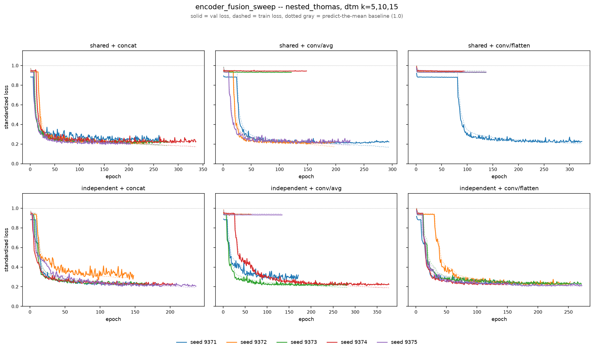

# encoder_fusion_sweep

*Generated from completed results under `results/nested_thomas/dtm_k5+10+15/pi_multik/_runs/encsweep_{combo}/`.*

## What stayed the same

- Process: `nested_thomas` (`configs/runs/nested_thomas/pi_multik.yaml`)
- Filtration: dtm, k = 5, 10, 15 (homology dims 0, 1)
- Seeds: 9371, 9372, 9373, 9374, 9375 (5 per combo)
- `include_entropy`: **false**
- `embedding_dim`: 64
- `conv_channels`: [32, 64, 128]
- `dropout`: 0.2
- `head_hidden_dims`: [64, 32]
- `head_dropout`: 0.1
- `batch_size`: 32
- `n_epochs`: 500
- `lr`: 0.001
- `weight_decay`: 0.0003
- `early_stopping_patience`: 50
- `resolution`: 64
- `sigma_pixels`: 0.75
- `pd_calibration_coverage`: 0.95
- `scale_fusion_hidden / out_dim / kernel_size (conv combos only)`: 128 / 128 / 3 (code defaults, not overridden)
- `scale_fusion_dropout / fusion_dropout (conv combos only)`: 0.0 / 0.0 (code defaults, not overridden)

## What varied

`encoder_mode` (shared-weight vs. independent-per-k `CoordConvPIEncoder`) x `fusion_mode`/`fusion_pool` (flat concat vs. `ConvFusion` avg-pool/flatten over the k axis) -- 6 combinations, run-tags `encsweep_{combo}`.

**Key finding:** conv-fusion combos aren't uniformly worse, they're *unstable* -- individual seeds collapse to ~0.90-0.95 test loss (predict-the-mean) while others land right on the concat baselines (~0.20). Only `independent + conv/flatten` (the old `pi_multik_towers` preset) converged cleanly on all 5 seeds.

## Results

| combo | encoder_mode | fusion_mode | fusion_pool | n | test loss (mean±sd) | adv loss (mean±sd) | failed seeds (>0.5) |
|---|---|---|---|---|---|---|---|
| shared + concat | shared | concat | — | 5 | 0.200 ± 0.009 | 0.213 ± 0.007 | 0/5 |
| independent + conv/flatten | independent | conv | flatten | 5 | 0.212 ± 0.005 | 0.222 ± 0.002 | 0/5 |
| independent + concat | independent | concat | — | 5 | 0.217 ± 0.028 | 0.230 ± 0.033 | 0/5 |
| shared + conv/avg | shared | conv | avg | 5 | 0.482 ± 0.345 | 0.506 ± 0.361 | 2/5 |
| independent + conv/avg | independent | conv | avg | 5 | 0.495 ± 0.335 | 0.517 ± 0.347 | 2/5 |
| shared + conv/flatten | shared | conv | flatten | 5 | 0.766 ± 0.284 | 0.800 ± 0.294 | 4/5 |
| *pi_multik baseline (10 seeds, no run-tag)* | shared | concat | — | 10 | 0.205 ± 0.012 | 0.210 ± 0.010 | 0/10 |
| *vihrs baseline* | — | — | — | 5 | 0.216 ± 0.002 | 0.219 ± 0.004 | 0/5 |

Loss = standardized (log + z-score) MSE on held-out test/adversarial splits, lower is better; ~1.0 = predicting the training mean (failed run). "Failed seeds" counts test_loss > 0.5.

## Training curves

Solid = val loss, dashed = train loss, per seed, one panel per combo. Dotted gray line at 1.0 marks the predict-the-mean trivial baseline -- panels with lines pinned near it show training collapse.
