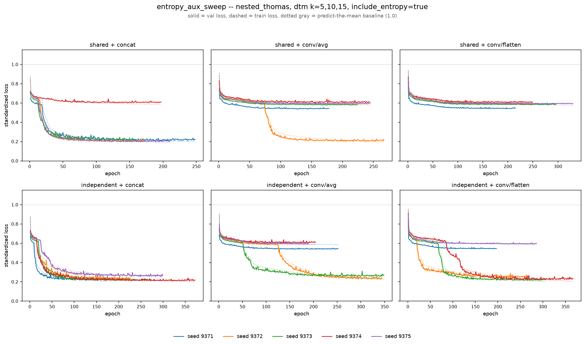

# entropy_aux_sweep

*Generated from completed results under `results/nested_thomas/dtm_k5+10+15/pi_multik/_runs/encsweep_{combo}_aux/`.*

## What stayed the same

- Process: `nested_thomas` (`configs/runs/nested_thomas/pi_multik.yaml`)
- Filtration: dtm, k = 5, 10, 15 (homology dims 0, 1)
- Seeds: 9371, 9372, 9373, 9374, 9375 (5 per combo)
- `include_entropy`: **true**
- `embedding_dim`: 64
- `conv_channels`: [32, 64, 128]
- `dropout`: 0.2
- `head_hidden_dims`: [64, 32]
- `head_dropout`: 0.1
- `batch_size`: 32
- `n_epochs`: 500
- `lr`: 0.001
- `weight_decay`: 0.0003
- `early_stopping_patience`: 50
- `resolution`: 64
- `sigma_pixels`: 0.75
- `pd_calibration_coverage`: 0.95
- `scale_fusion_hidden / out_dim / kernel_size (conv combos only)`: 128 / 128 / 3 (code defaults, not overridden)
- `scale_fusion_dropout / fusion_dropout (conv combos only)`: 0.0 / 0.0 (code defaults, not overridden)

## What varied

`encoder_mode` (shared-weight vs. independent-per-k `CoordConvPIEncoder`) x `fusion_mode`/`fusion_pool` (flat concat vs. `ConvFusion` avg-pool/flatten over the k axis) -- 6 combinations, run-tags `encsweep_{combo}_aux`.

Identical to `encoder_fusion_sweep` except `include_entropy: true` -- adds per-(homology dim, k) persistence-entropy columns to the extra scalar side-vector (on top of the `[log N]` feature every combo already gets). **Key finding:** this did not clearly help or hurt the seeds that converge normally, but it made training *less* reliable overall -- it destabilized `shared + concat` and `independent + conv/flatten`, both of which had zero failures in the original sweep. Unlike the original sweep's ~0.90-0.95 full collapse (stuck from epoch 1, never moves), the training curves here show a **long plateau around 0.55-0.65** that some seeds eventually break out of after 50-150 stalled epochs (e.g. `independent + conv/avg`'s seeds 9372/9373 -- see figure) while others stay stuck for the whole run. That's a different, more specific failure mode than "unstable": worth a rerun with a higher `early_stopping_patience` (currently 50) before concluding these seeds are unrecoverable -- some may just need longer to escape the plateau.

## Results

| combo | encoder_mode | fusion_mode | fusion_pool | n | test loss (mean±sd) | adv loss (mean±sd) | failed seeds (>0.5) |
|---|---|---|---|---|---|---|---|
| independent + concat | independent | concat | — | 5 | 0.217 ± 0.021 | 0.231 ± 0.018 | 0/5 |
| shared + concat | shared | concat | — | 5 | 0.269 ± 0.142 | 0.289 ± 0.162 | 1/5 |
| independent + conv/flatten | independent | conv | flatten | 5 | 0.370 ± 0.177 | 0.384 ± 0.184 | 2/5 |
| independent + conv/avg | independent | conv | avg | 5 | 0.444 ± 0.160 | 0.469 ± 0.173 | 3/5 |
| shared + conv/avg | shared | conv | avg | 5 | 0.502 ± 0.148 | 0.531 ± 0.161 | 4/5 |
| shared + conv/flatten | shared | conv | flatten | 5 | 0.583 ± 0.017 | 0.611 ± 0.002 | 5/5 |
| *pi_multik baseline (10 seeds, no run-tag)* | shared | concat | — | 10 | 0.205 ± 0.012 | 0.210 ± 0.010 | 0/10 |
| *vihrs baseline* | — | — | — | 5 | 0.216 ± 0.002 | 0.219 ± 0.004 | 0/5 |

Loss = standardized (log + z-score) MSE on held-out test/adversarial splits, lower is better; ~1.0 = predicting the training mean (failed run). "Failed seeds" counts test_loss > 0.5.

## Training curves

Solid = val loss, dashed = train loss, per seed, one panel per combo. Dotted gray line at 1.0 marks the predict-the-mean trivial baseline -- panels with lines pinned near it show training collapse.
